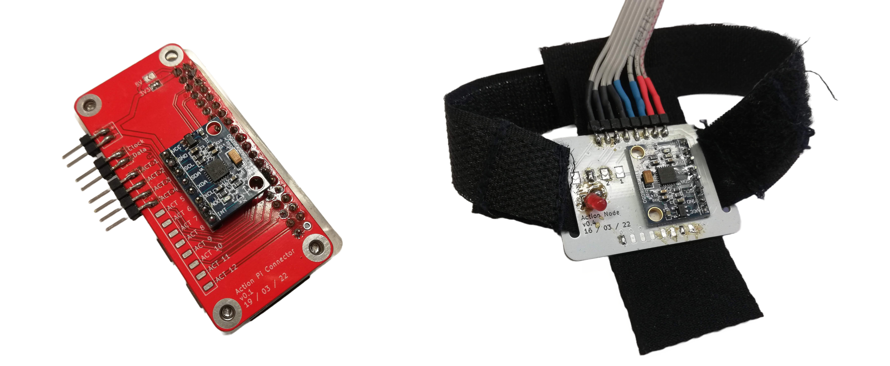
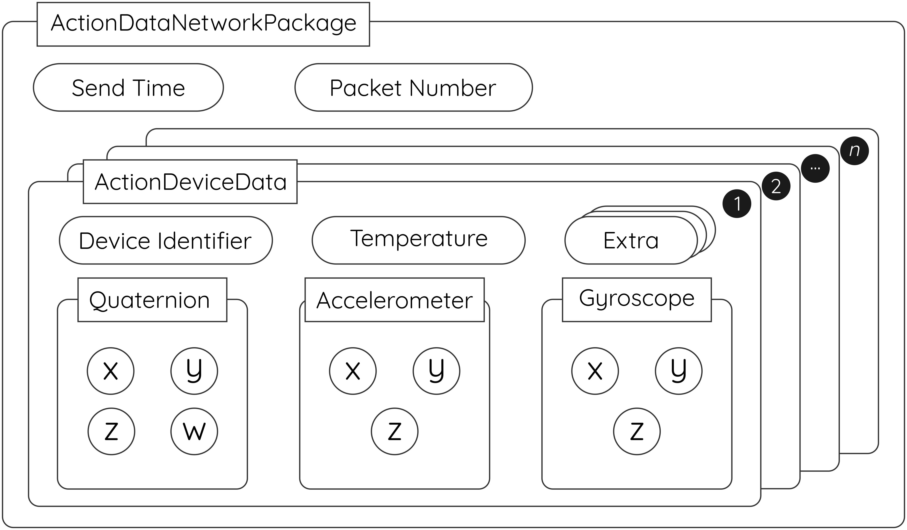

# Action Tracer

## Overview

A masters project by Humphrey Chiramba, at the University of Cape Town.

The goal of Action Tracer is to provide a low-cost, easy to make motion caputure system using Inertial Measurment Units (IMUs). In this project, 6-axis IMUs are used together with a Raspberry Pi Zero W to collect data and transmit it via a Wi-Fi network to a host computer.

This project is supported by other repositories as well that may be of interest.

##### Building Blocks

- [I2C Device Library](https://github.com/jrowberg/i2cdevlib): Jeff Rowberg's I2C implementation for devices on the Raspberry Pi and various other plaforms
- [MPU6050-MotionTracking](https://github.com/Edubgr/MPU6050-MotionTracking): Eduardo Guimarães implementation of motion tracking in C++ for the Raspberry Pi and MPU6050 IMU.

##### Sibling Repositories

- [Action Figure](https://github.com/chirambaht/ActionFigure): A simple Unity 3D application to help in recording data for this project.
- [Action Node](https://github.com/chirambaht/ActionNode): The main board that holds the IMU and connects to other nodes.
- [Action Connector](https://github.com/chirambaht): The companion connector board for the Action Node that attaches to the Raspberry Pi, allowing easier connections to the nodes.
- [Basic Action](https://github.com/chirambaht/basic_action): A basic Android application that allows a user to communicate via the Action Tracer API to collect data.

### Action Tracer in images (and GIFs)

<figure>
    
    <figcaption>The two nodes used for the project. On the left is the Action Connector and on the right is the Action Node.</figcaption>
</figure>

## Running Action Tracer

In order to run this software, a few system configurations need to be set. Some of these are mandatory, while others may be ommited. Be sure to install all the dependencies first.

1.  Install all the [dependencies](#dependancies)

2.  Enable the I2C bus:
    `sudo raspi-config` > _Interface Options_ > _I2C_ > _Enable_

3.  (Optionall) I2C speed. This is done by editing your Pi config file as follows:

    > `sudo nano /boot/config.txt`
    > Add the following line to the bottom of the file, if not there:
    > `dtparam=i2c_baudrate=BAUDRATE`, where `BAUDRATE` is your speed (recommended 400000 = 400kHz)
    > If you are using a Pi 3B, 3B+ and Zero W, you need to also add:

        `core_freq=250`

    > Reboot the sytem with `sudo reboot`

---

**Note:**
At this stage, you would need to copy all the source files to the same directory as that you are working in, and compile the files. An easier way to run this software is to run the code on the [collection](https://github.com/chirambaht/Action-Tracer/tree/collection) branch.

### Method of operation

The Raspberry Pi will act as a web server on the local network with it's allocated IP address on port **9022**. When started, the device will enter calibration (which can be disabled) and after it is complete, wait for a connection (currently limited to 2 devices). Once a device connects, the device will indeicate it is about to transmit data and proceed to do so.

Should a client disconnect, the program will safely stop running. It will also disconnect should it receive a disconnect message. To understand the messaging format more, visit the [Google Protocol Buffers](https://developers.google.com/protocol-buffers) website for your relevant language(C++, C#, Dart, Go, Java, Kotlin or Python). In a nutshell, the image below provides a useful overview of the packet structure.

<figure>
    
    <figcaption>Each package has a packet number and timestamp. A package will carry muliple device data packets. Each packet has an identifier as well as data such as quaternions, accelerometer and gyroscope readings, temperature as well as any other optional data packets.</figcaption>
</figure>

**NB: _When sending data, Action Tracer will send the length of the data data packet followed by the packet itself_.**

## Dependancies

- git: `sudo apt install git`
- Make: `sudo apt install build-essential`
- Protobuf compiler: `sudo apt install protobuf-compiler`
- Python3: `sudo apt install python3`
- SMBus: `sudo apt install python3-smbus python3-dev i2c-tools`
- Wiring Pi: `wget https://github.com/WiringPi/WiringPi/releases/download/2.61-1/wiringpi-2.61-1-armhf.deb` > `sudo dpkg -i wiringpi-2.61-1-armhf.deb`

or just run the dependencies installer, `chmod +x dependancies.sh` > `sudo ./dependancies.sh`.

## Documentation

View the [documentation](https://chirambaht.github.io/Action-Tracer/).
